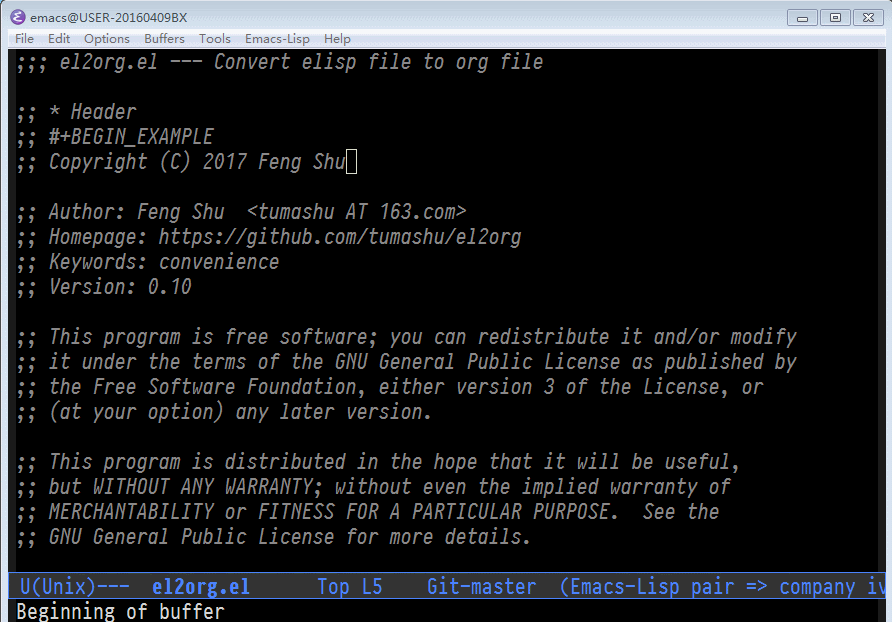

- [What is el2org](#org3a82089)
  - [Installation](#orgd7c42de)
  - [Configure](#org06973fc)
  - [Usage](#org0e4d7ae)

# What is el2org

el2org is a simple tool，which can convert a emacs-lisp file to org file. You can write code and document in a elisp file with its help.

               (convert to)                    (export to)
    elisp  -----------------> org (internal) --------------> other formats

Note: el2org.el file may be a good example.

## Installation

1.  Config melpa source, please read: <http://melpa.org/#/getting-started>
2.  M-x package-install RET el2org RET
3.  M-x package-install RET ox-gfm RET

    ox-gfm is needed by \`el2org-generate-readme', if ox-gfm can not be found, ox-md will be used as fallback.

## Configure

    (require 'el2org)
    (require 'ox-gfm)

## Usage

1.  \`el2org-generate-file' can convert an elisp file to other file format which org's exporter support.
2.  \`el2org-generate-readme' can generate README.md from elisp's "Commentary" section.
3.  \`el2org-generate-html' can generate a html file from current elisp file and browse it.
4.  \`el2org-generate-org' can generate a org file from current elisp file.

Converted from el2org.el by (el2org)[https://github.com/tumashu/el2org].